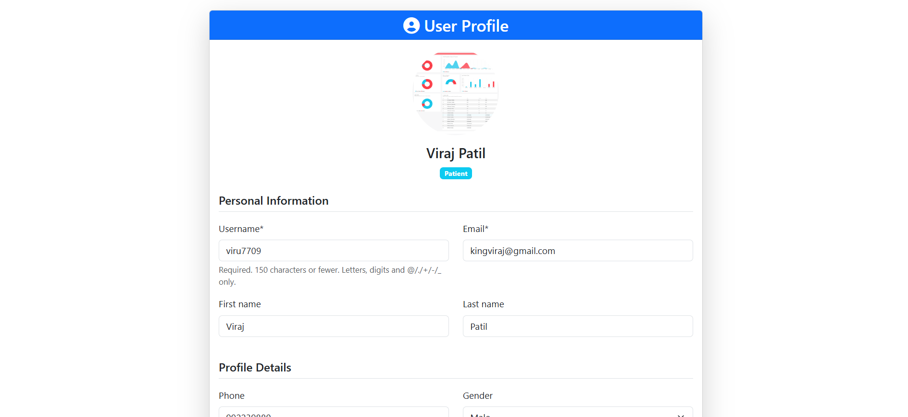
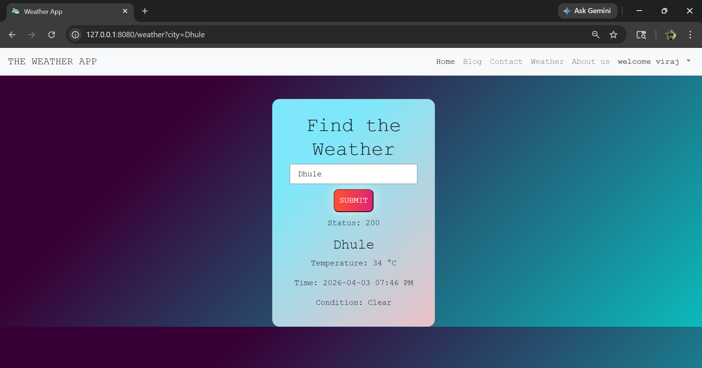

# 🌦️ Smart Weather Alert System (50 KM Radius Notification)

## 📌 Overview
This project is a real-time weather alert system designed to provide early warnings about weather conditions such as rainfall and wind speed. The system notifies users within a 50-kilometer radius when significant weather changes are detected in nearby locations.

The primary goal of this project is to support rural communities and farmers by providing timely and localized weather alerts, helping them prepare in advance and reduce potential losses.

## 📸 Screenshots

### 🖥️ Dashboard View

### 🌧️ Weather Alert Example

---

## 🎯 Problem Statement
In many rural areas, farmers do not receive timely weather updates, which leads to crop damage and financial loss due to sudden rainfall or strong winds.

This system aims to solve this problem by:
- Providing real-time alerts
- Covering nearby regions (up to 50 km)
- Delivering actionable weather information

---

## ⚙️ Features
- 🌧️ Real-time rain detection and alerts  
- 🌬️ Wind speed monitoring (km/h)  
- 📍 Location-based notification system (50 km radius)  
- 🔔 Alert system for nearby users  
- 🌐 API-based weather data integration  
- 📊 Dynamic weather data display (temperature, humidity, etc.)  
- 🐳 Containerized deployment using Docker  
- ☁️ Cloud deployment (Railway platform - in progress)

---

## 🧠 System Architecture
User Location → Weather API → Django Backend → Processing Logic → Radius Calculation → Notification System

---

## 🛠️ Tech Stack

### Backend:
- Python
- Django

### Frontend:
- HTML
- CSS

### APIs:
- Weather API (e.g., OpenWeather / Tomorrow.io)

### Tools & Deployment:
- Docker (containerization)
- Railway (cloud deployment)
- Git & GitHub

---

## 📍 How It Works
1. The system collects real-time weather data using external APIs.
2. It detects weather conditions such as rainfall and wind speed.
3. If a weather event is detected in a specific location, the system calculates a 50 km radius.
4. Users within this radius receive alerts, allowing them to prepare in advance.

---

## 🚀 Future Enhancements
- 📱 Mobile app integration  
- 📡 Improved prediction using machine learning  
- 🌾 Crop-specific recommendations for farmers  
- 🔔 SMS/Push notification system  
- 🌍 Multi-location tracking and dashboard  

---

## 💡 Impact
This project is designed to create real-world impact by:
- Helping farmers take preventive actions  
- Reducing crop damage  
- Improving access to localized weather information  
- Supporting smart agriculture initiatives  

---

## 📌 Status
🚧 Currently under active development and improvement  
(Continuous updates and feature enhancements in progress)

---

## 👨‍💻 Author
**Viraj Yogesh Patil**  
- GitHub: https://github.com/virajpa4  
- LinkedIn: https://www.linkedin.com/in/viraj4patil/

---

## ⭐ Note
This project reflects my interest in building scalable, real-time systems that solve real-world problems, particularly in agriculture and rural development.